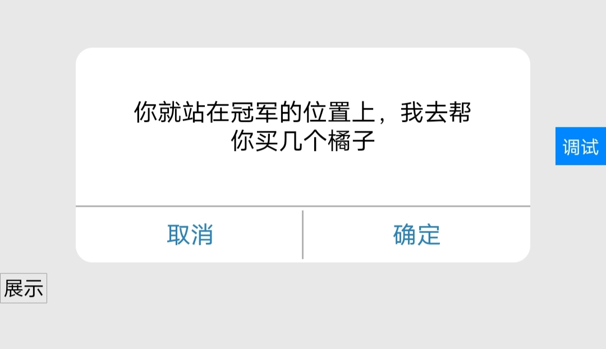

# WebSelf
  webSelf存储库是用来存储一些我在前段学习的道路上写的一些可以供大家一起用的小案例。
### 目录
```
  * 原生
  * Alert 失效
  * salert
  * spop
```
 [点击跳转](https://github.com/Gshihao/WebSelf/tree/main/Alert)
 
 # salert
 ### 效果展示
 
 ### 产品介绍
  Salert是Alert的改进版，通过链接添加
  [Salert](https://github.com/Gshihao/WebSelf/tree/a16049dbe51d2990f047cf1a6d1feb6758d0cfce/Salert)
存储自己写的一些小插件Store some little plug-ins you write
